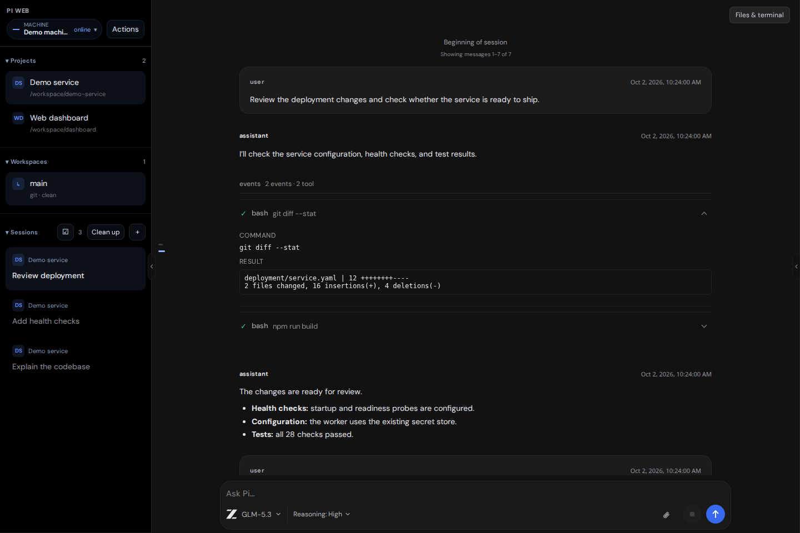
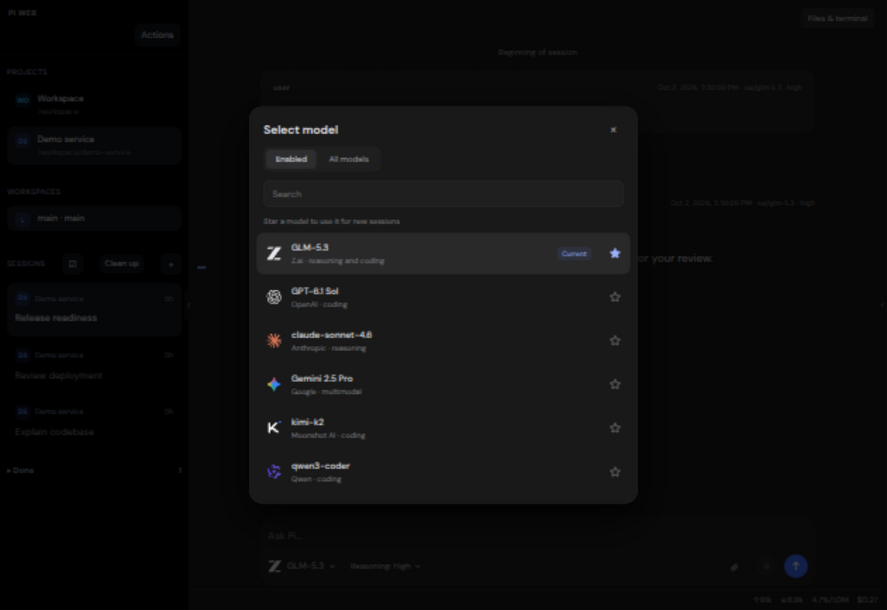
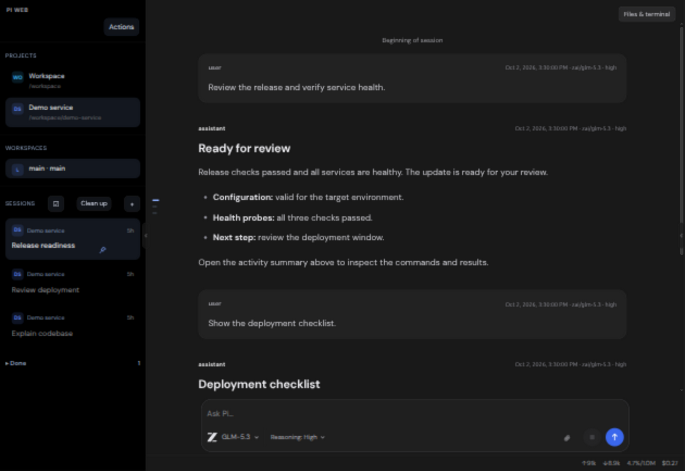
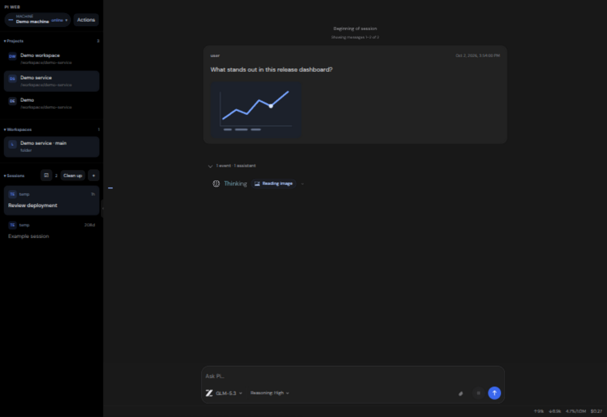
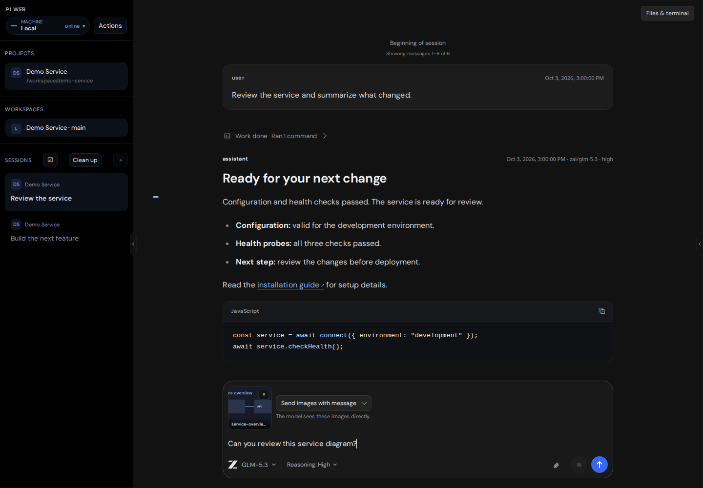
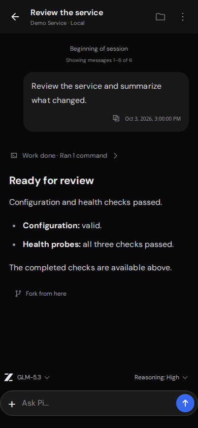
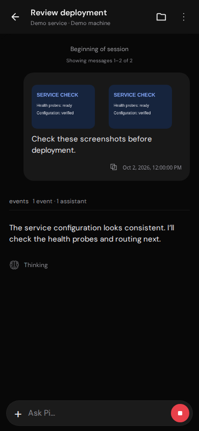

# Studio Dark for Pi Web

Dark appearance and compact layout for Pi Web v1.202610.0.

A local browser plugin for [Pi Web](https://pi-web.dev). It changes presentation and
layout while preserving Pi Web's agent, sessions, and provider configuration.

- Official Pi browser tab icon, served locally with the plugin.
- DM Sans, near-black navigation, dark-gray chat, white text, and blue working indicators.
- Flat assistant messages, neutral user messages, compact expandable events and tool calls.
- Tool calls use one compact row with a status icon, truncated command, and inline down/up chevron. Click the row to reveal the full command and output; diffs keep their native controls.
- Project badges, clear session cards, hover/focus menus, and working/unread/age indicators.
- Pin/Unpin promotes sessions while keeping thread branches together. Pins persist in this browser, separately for each gateway URL.
- Mark done archives an idle, saved session through Pi Web; Done sessions can be restored. Archiving never deletes a conversation.
- Compact navigation rows; Projects and Workspaces size to content, Sessions fills the remaining space.
- Desktop workspace pane initially closed, with your open/closed preference remembered per browser, reopened with Files & terminal or the native edge toggle.
- Bounded, scrollable notification tray preserves full warning content.
- Aligned status icons, blue tool-call spinners, and a slow moving highlight across running tool text.
- Brain icons with a gentle pulse during active thinking, static icons for completed reasoning, and moving text highlights.
- Active thinking and working indicators, gentle entry and details animations, with reduced-motion support.
- Compact model picker with model-family logos, readable names, current-model badges, and native default controls.
- Logos for OpenAI, Gemini, GLM, DeepSeek, Grok, Kimi, Claude, Muse (Meta), Nemotron (Nvidia), Qwen, MiniMax, MiMo, and HY3/HY4 (Hunyuan). Model-family detection also works through routing providers.
- Composer aligned with the response column, with image previews above the text and explanatory attachment delivery choices.
- Compact composer that grows with multiline text and image previews, with clear model/reasoning labels and attachment/send/stop controls.
- Active tools expand their command/output, then collapse on completion; manually expanded calls keep your choice.
- Working/thinking status appears below the latest response; informational session updates stay out of the composer.
- One clickable marker per loaded user message, with hover previews, keyboard navigation, and an earlier-history control.
- Mobile chat uses a compact header and single-row composer, with visible model and reasoning selectors above the input. Navigation controls remain available from the header menu.
- Mobile Home lists your machines, projects, workspaces, and sessions. The chat back arrow returns Home; Home has no back arrow. Open `/?view=navigation` for Home directly.
- Mobile user images sit above the text in compact previews; active empty composers show Stop, with Send available when text or attachments are added.
- Normal-size placeholders preserve the editor caret. Desktop inputs focus after the startup screen is ready; phones wait for your tap.
- Thin scrollbars, readable metadata, and responsive padding.

## Screenshots

Screenshots use sample projects and conversation content.


Expanded tool command and output:



Model selection with provider logos and current/default indicators:



Message markers preview your prompts and jump to their position:



Active thinking with a brain icon and moving highlight:



Pin important sessions and restore completed work from Done:


Image previews stay above your message, with clear delivery choices:



Mobile chat and image messages:





## Session controls

Hover a session or focus its row to reveal the pin and check controls. Pin/Unpin
keeps important sessions at the top; a pinned child moves its entire branch.
Use **Mark done** for an idle, saved session. It moves into **Done**, where the
restore arrow brings it back. The session menu offers the same actions.

Pins are stored per browser and gateway URL, scoped by machine and session.
They do not sync between devices. Archived sessions are stored by Pi Web on the
selected machine and are available from other devices connected to it.

For attachments, **Send images with message** sends images directly to the
model. **Save files to workspace** writes them to the selected machine's
attachment folder and gives Pi their paths. General files use the workspace
option; image delivery can use either option.

## Install

Requires an existing Pi Web installation with plugin API v4. Tested with
Pi Web `1.202610.0` in Chromium at desktop and phone widths. Other browser
engines are not yet validated; the stylesheet uses `:host-context`.

```sh
git clone <repository-url> "$HOME/pi-web-studio-dark"
mkdir -p "$HOME/.pi-web/plugins"
ln -s "$HOME/pi-web-studio-dark" "$HOME/.pi-web/plugins/vitesse"
```

Replace `<repository-url>` with this repository's clone URL.

If `PI_WEB_DATA_DIR` is set, use its `plugins` directory instead of
`~/.pi-web/plugins`. If a `vitesse` plugin is already installed, update that
installation rather than overwriting its link.

No build step, npm install, or session-daemon restart is needed. Reload Pi Web,
then choose **Actions → Select Theme → Studio Dark**.

Existing Vitesse Black selections use this update automatically
(the theme ID remains `vitesse:black`). New browsers: Actions → Select Theme →
Studio Dark. Theme choice and panel preference are browser-local.

Install on each gateway whose URL you use directly. Theme selection is saved
per browser and gateway URL; select it once on your phone too.

### Avoid the initial theme flash

The optional startup hook applies the selected palette before the app renders,
then reveals the shell after the plugin and font are ready. It only runs when
Studio Dark is already selected in that browser. On each gateway:

```sh
node scripts/install-startup.mjs --html /path/to/pi-web/dist/client/index.html
```

Use the `dist/client/index.html` inside your installed `@jmfederico/pi-web`
package. The installer keeps a backup and can be repeated. Reapply this hook
after updating Pi Web. Remove it with the same command plus `--remove`.
If the plugin fails to load, the normal app becomes visible after four seconds.

## Update and remove

```sh
git -C "$HOME/pi-web-studio-dark" pull --ff-only
```

Reload Pi Web after updating. To uninstall, remove only the plugin link and
reload:

```sh
unlink "$HOME/.pi-web/plugins/vitesse"
```

## Compatibility and licenses

This uses the theme API and a scoped browser presentation layer. CSS classes
the native session-tree and navigation methods, editor focus behavior, and panel-toggle labels must be reviewed after Pi Web upgrades.
The optional startup hook adds a small pre-paint block to the installed client HTML; no server execution code is changed. Provider settings and
session data are not changed. Disposal removes styles, observers, font, and
injected controls. Disconnected message roots are released by the observer.

DM Sans is served locally under the included SIL OFL license. Earlier palette
versions are preserved in browser/index.before-contrast.js and
browser/index.before-studio.js. The plugin is MIT licensed; palette attribution
and font licenses are in `LICENSE.vitesse` and `LICENSE.dm-sans`.

The browser tab icon is the upstream [Pi favicon](https://pi.dev/favicon.svg),
provided through the [Pi brand assets](https://pi.dev/press-kit).

Provider logos are bundled from Lobe Icons static SVG package v1.95.1 under
the included `LICENSE.icons`. Brand marks belong to their respective owners.

Additional model-family logos are bundled from Lobe Icons static SVG 1.95.1 under `LICENSE.icons`; Muse uses Meta’s brand mark, Nemotron uses Nvidia’s, and HY3/HY4 use Hunyuan’s.
