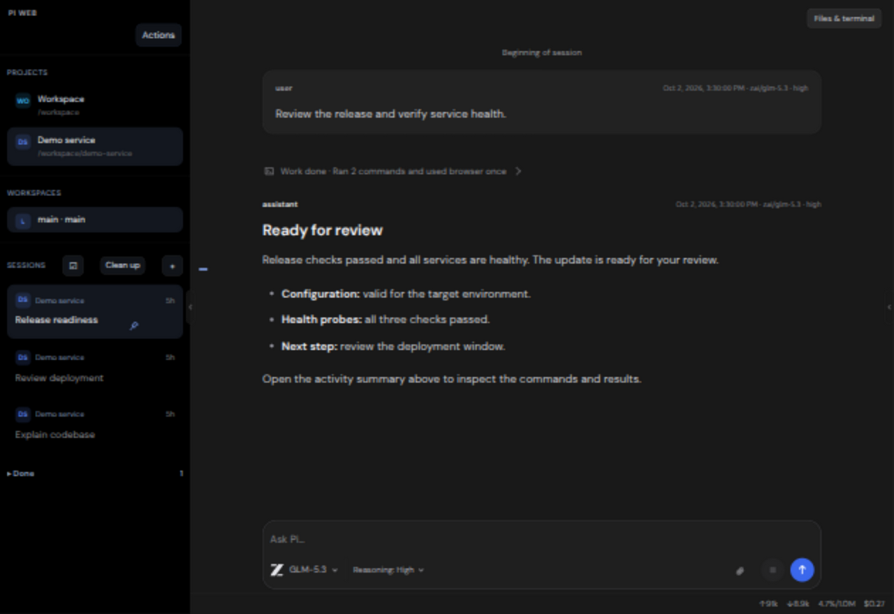
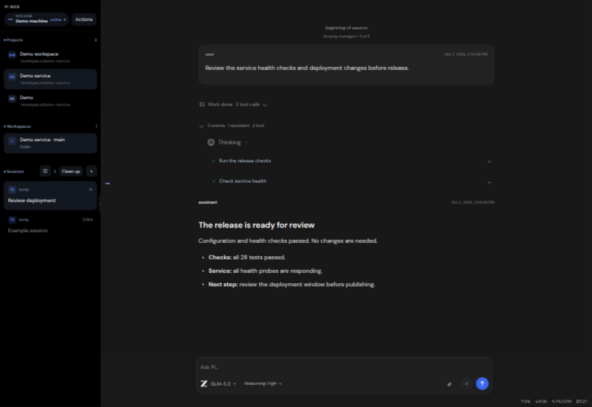
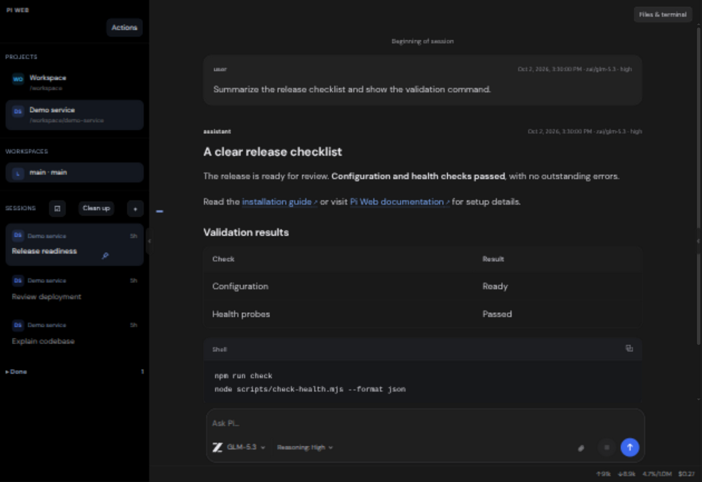

# Studio Dark for Pi Web

Dark appearance and compact layout for Pi Web v1.202610.0.

A local browser plugin for [Pi Web](https://pi-web.dev). It changes presentation and
layout while preserving Pi Web's agent, sessions, and provider configuration.

An independent community plugin, not an official Pi Web or model-provider
product. A free, open-source hobby project. Anyone can install, modify, and
redistribute it under the included licenses.

## Quick install

With Pi Web already installed, run this on the machine serving its browser UI:

You need Git and the Node.js version required by your existing Pi Web install.
The quick command below is for a POSIX shell, such as Linux, macOS, or WSL.

```sh
git clone https://github.com/filius-fall/pi-web-studio-dark.git "$HOME/pi-web-studio-dark" && node "$HOME/pi-web-studio-dark/scripts/install.mjs"
```

Reload Pi Web and choose **Actions → Select Theme → Studio Dark**. On mobile,
open **Session options → Actions → Select Theme**. Select it once in each browser.
No build step or dependency install is needed.

**If you are a coding agent, read [AGENTS.md](AGENTS.md) before installing or
updating this theme.** It contains the exact commands, custom-directory options,
activation steps, verification, and update instructions.

Installing with a coding agent? Tell it: “Read AGENTS.md and install Studio Dark
on the machine serving my Pi Web URL.”

The installer creates the plugin link, respects `PI_WEB_DATA_DIR`, and detects
the installed Pi Web client for the startup theme fix. Existing plugin links
are never overwritten. Keep the cloned folder in place while using the theme.

## Features

- Official Pi browser tab icon, served locally with the plugin.
- DM Sans, near-black navigation, dark-gray chat, white text, and blue working indicators.
- Flat assistant messages, neutral user messages, compact expandable events and tool calls.
- Completed response activity collapses into one Work done dropdown; expand it to inspect thinking, updates, skills, and tool calls. Repeated event headers and divider lines are removed.
- A shared 800px reading and composer column, 16px DM Sans body text, generous paragraph/list spacing, and a clear heading hierarchy.
- Blue underlined hyperlinks, subtle inline code, readable tables, and horizontally scrollable code panels with language labels and native copy controls.
- Tool calls use clean, nested action rows with status icons and independent expanders. Open any row to inspect its full command and result; diffs keep their native controls.
- Project badges, clear session cards, hover/focus menus, and working/unread/age indicators.
- Pin/Unpin promotes sessions while keeping thread branches together. Pins persist in this browser, separately for each gateway URL.
- Mark done archives an idle, saved session through Pi Web; Done sessions can be restored. Archiving never deletes a conversation.
- Compact navigation rows; Projects and Workspaces size to content, Sessions fills the remaining space.
- Desktop workspace pane initially closed, with your open/closed preference remembered per browser, reopened with Files & terminal or the native edge toggle.
- Bounded, scrollable notification tray preserves full warning content.
- Aligned status icons, blue tool-call spinners, and a slow moving highlight across running tool text.
- Brain icons with a gentle pulse during active thinking, static icons for completed reasoning, and moving text highlights.
- Active thinking and working indicators, gentle entry and details animations, with reduced-motion support.
- Compact model picker with model-family logos, readable names, current-model badges, and native default controls.
- Logos for OpenAI, Gemini, GLM, DeepSeek, Grok, Kimi, Claude, Muse (Meta), Nemotron (Nvidia), Qwen, MiniMax, MiMo, and HY3/HY4 (Hunyuan). Model-family detection also works through routing providers.
- Composer aligned with the response column, with image previews above the text and explanatory attachment delivery choices.
- Compact composer that grows with multiline text and image previews, with clear model/reasoning labels and attachment/send/stop controls.
- Active tools expand their command/output, then collapse on completion; manually expanded calls keep your choice.
- Working/thinking status appears below the latest response; informational session updates stay out of the composer.
- One clickable marker per loaded user message, with hover previews, keyboard navigation, and an earlier-history control.
- Mobile chat uses a compact header and single-row composer, with visible model and reasoning selectors above the input. Navigation controls remain available from the header menu.
- Mobile Home lists your machines, projects, workspaces, and sessions. The chat back arrow returns Home; Home has no back arrow. Open `/?view=navigation` for Home directly.
- Mobile user images sit above the text in compact previews; active empty composers show Stop, with Send available when text or attachments are added.
- Normal-size placeholders preserve the editor caret. Desktop inputs focus after the startup screen is ready; phones wait for your tap.
- Thin scrollbars, readable metadata, and responsive padding.

## Screenshots

The screenshots show Studio Dark with demonstration content. Every desktop feature image includes the full app and sidebar; mobile screenshots are grouped at the end.

### Full app overview

The complete desktop layout: sidebar, conversation, completed work, and composer.


### Completed work

One dropdown keeps completed activity out of the way. Open it to inspect progress
updates, thinking, and tool calls while the final answer remains visible.
Activity groups start collapsed with a plain-language summary such as
**Ran 4 commands and used browser once**. Open a group to inspect its steps.
Queued messages appear as compact bubbles aligned with the conversation.
Use the composer's **Send now** (steer) button to deliver a new instruction at
the next model call. Pi Web's current API cannot promote an individual message
that is already queued; **Clear queue** keeps its native whole-queue behavior.





### Tool details and thinking

Tool calls use short names such as **Run script**, **Check logs**, and **Read file**
while running and after completion. They appear as evenly spaced action rows, nested under completed
work without stacked divider rails. Expand any call for its full command and
result in roomy, wrapped panels. Thinking uses a gentle brain animation, and
image analysis adds a small scanning indicator while the model reads an
attachment.


### Models and sessions

Model-family logos and current/default indicators make selection clear. Pin
important sessions and restore completed work from Done.


### Reading and message navigation

Headings, links, lists, tables, and code panels share a consistent reading layout.
Message markers preview your prompts and jump to their position.




### Images and attachments

Image previews stay above your message, with clear delivery choices.


### Mobile

The complete mobile chat includes the session header, response, model/reasoning
selectors, and compact input. Image messages and the reading layout adapt to
phone screens.


## Session controls

Hover a session or focus its row to reveal the pin and check controls. Pin/Unpin
keeps important sessions at the top; a pinned child moves its entire branch.
Use **Mark done** for an idle, saved session. It moves into **Done**, where the
restore arrow brings it back. The session menu offers the same actions.

Pins are stored per browser and gateway URL, scoped by machine and session.
They do not sync between devices. Archived sessions are stored by Pi Web on the
selected machine and are available from other devices connected to it.

For attachments, **Send images with message** sends images directly to the
model. **Save files to workspace** writes them to the selected machine's
attachment folder and gives Pi their paths. General files use the workspace
option; image delivery can use either option.

## Install

Requires an existing Pi Web installation with plugin API v4. Tested with
Pi Web `1.202610.0` in Chromium at desktop and phone widths. Other browser
engines are not yet validated; the stylesheet uses `:host-context`.

```sh
node "$HOME/pi-web-studio-dark/scripts/install.mjs"
```

This command can be run again safely after updates. Clone the repository first
using the quick install command above, or run `node scripts/install.mjs` from
an existing checkout.

For a custom data directory or package location:

```sh
node scripts/install.mjs --data-dir /path/to/pi-web-data --html /path/to/pi-web/dist/client/index.html
```

Use `--no-startup` to install only the plugin. If Pi Web cannot be detected or
its client HTML is not writable, the theme still installs; the installer reports
that the optional startup fix was skipped. No administrator privileges are
required for the plugin itself.

No build step, npm install, or session-daemon restart is needed. Reload Pi Web,
then choose **Actions → Select Theme → Studio Dark**.

Existing Vitesse Black selections use this update automatically
(the theme ID remains `vitesse:black`). New browsers: Actions → Select Theme →
Studio Dark. Theme choice and panel preference are browser-local.

Install on each gateway whose URL you use directly. Theme selection is saved
per browser and gateway URL; select it once on your phone too.

### Troubleshooting

- **The theme is missing:** run the installer on the machine serving the URL
  you opened, confirm its data directory, and reload the page. Select Studio
  Dark using Actions; merely installing it does not change other browsers.
- **The clone folder already exists:** use the update commands below rather
  than cloning again. Keep the folder in place; the plugin link points to it.
- **Another plugin occupies the link:** the installer stops without replacing
  it. Update that checkout, or remove only its plugin link before installing.
- **A brief theme flash remains:** check the installer's startup-hook message.
  A custom package path may require `--html`. Reapply after upgrading Pi Web.
- **An update looks cached:** reload the gateway page. If it still shows an old
  layout, refresh without cache and confirm the checkout was updated on that
  gateway. No session-daemon restart is required for plugin updates.

### Avoid the initial theme flash

The optional startup hook applies the selected palette before the app renders,
then reveals the shell after the plugin and font are ready. It only runs when
Studio Dark is already selected in that browser. On each gateway:

```sh
node scripts/install-startup.mjs --html /path/to/pi-web/dist/client/index.html
```

Use the `dist/client/index.html` inside your installed `@jmfederico/pi-web`
package. The installer keeps a backup and can be repeated. Reapply this hook
after updating Pi Web. Remove it with the same command plus `--remove`.
If the plugin fails to load, the normal app becomes visible after four seconds.

## Update and remove

```sh
git -C "$HOME/pi-web-studio-dark" pull --ff-only
node "$HOME/pi-web-studio-dark/scripts/install.mjs"
```

Reload Pi Web after updating. To uninstall, select another theme, then remove
only the plugin link and reload:

```sh
unlink "$HOME/.pi-web/plugins/vitesse"
```

For a custom data directory, remove its `plugins/vitesse` link instead. To
remove the optional startup hook as well, run the startup command above with
`--remove` before deleting the cloned folder.

## Compatibility and licenses

This uses the theme API and a scoped browser presentation layer. CSS classes
the native session-tree and navigation methods, editor focus behavior, and panel-toggle labels must be reviewed after Pi Web upgrades.
The optional startup hook adds a small pre-paint block to the installed client HTML; no server execution code is changed. Provider settings and
session data are not changed. Disposal removes styles, observers, font, and
injected controls. Disconnected message roots are released by the observer.

The plugin code is MIT licensed: anyone may install, use, modify, and distribute
it, including commercially, while retaining the required copyright and license
notices. Bundled assets keep their own licenses; the font is under SIL OFL 1.1.
Do not sell the font by itself or remove its OFL notice.

See [Third-party notices](THIRD_PARTY_NOTICES.md) for every bundled asset's
source, license, and redistribution requirements, and [Asset provenance](docs/asset-provenance.json)
for file hashes. All third-party license texts are included in this repository.

Brand names and logos identify the selected models and the compatible host.
They belong to their respective owners. The code's MIT license does not grant
trademark rights or imply endorsement. Follow the owners' applicable brand
rules when redistributing or promoting a modified version. Model logos do not
grant access to models; provider accounts and service terms remain separate.

The Pi favicon is an unmodified asset from the MIT-licensed Pi website source,
with its copyright notice retained in `LICENSE.pi`. Pi Web screenshot attribution
is retained in `LICENSE.pi-web`. Screenshots use demonstration content.

This is a license and provenance review, not a guarantee against all legal
claims. Rights holders can have additional trademark requirements, and laws
and service terms vary by jurisdiction and use.

## Sharing and contributions

A description you can use when sharing the project:

> Studio Dark is a free, open-source community theme for Pi Web. It adds a dark
> layout, compact tool calls, clearer model controls, and a mobile-friendly
> composer. It installs into an existing Pi Web setup without a build step.

Link readers to this README for installation, screenshots, compatibility, and
licenses. Suggestions and fixes are welcome; see [Contributing](CONTRIBUTING.md)
for source and attribution requirements.
